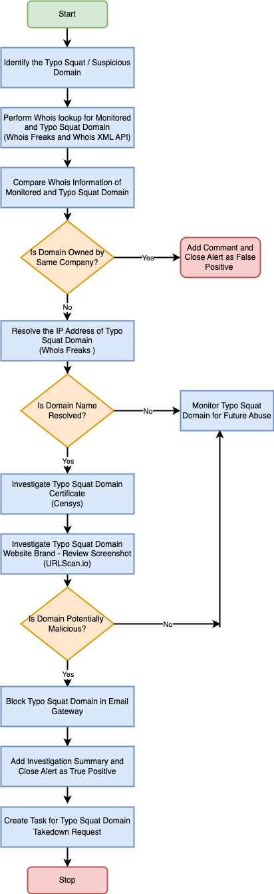

| [Home](../README.md) |
|----------------------|

# Usage

Refer to [Simulate Scenario documentation](https://github.com/fortinet-fortisoar/solution-pack-soc-simulator/blob/develop/docs/usage.md) to understand how to simulate and reset scenarios.

To understand the process FortiSOAR follows to respond to alerts related to typo squatted domains, we have included a scenario &mdash; **Typo Squatting Domain Detected** &mdash; with this solution pack.

## Scenario &mdash; Typo Squatting Domain Detected

This scenario generates following three example alert of Type *Phishing* in FortiSOAR's **Alerts** module:

1. **Typo Domain Detected - `microsoft-2022.online`**

    - The demo alert created is an example of a domain that is *Highly Suspicious*
    - The alert is of type *Phishing*
    - The reported alert contains the following information:
        - **Typo Domain**: `microsoft-2022.online`
        - **Original Domain**: `microsoft.com`
        - **Severity Score**: `67`
        - **Status**: `High`
        - **Source**: FortiRecon Brand Protection
        - **Source ID**: `d8c84a15-cd44-48ee-abbb-00904d31b066`
        - **Source IP**: `52.50.167.226`
        - Indicators created and associated for:
            - Monitored domain
            - Typo domain
            - Source IP Address

2. **Typo Domain Detected - `acmedemoshop.com`**

    - The demo alert created is an example of a domain that is *Critical*
    - The alert is of type *Phishing*
    - The reported alert contains the following information:
        - **Typo Domain**: `acmedemoshop.com`
        - **Original Domain**: `acmedemo.com`
        - **Severity Score**: `88`
        - **Status**: `Critical`
        - **Source**: FortiRecon Brand Protection
        - **Source ID**: `c8c84a15-cd44-48ee-abbb-00904d21b088`
        - **Source IP**: `99.83.154.118`
        - Indicators created and associated for:
            - Monitored domain
            - Typo domain
            - Source IP Address
            - Host

3. **Typo Domain Detected - `log-in-outlook.com`**

    - The demo alert created is an example of a domain that is *Critical*
    - The alert is of type *Phishing*
    - The reported alert contains the following information:
        - **Typo Domain**: `log-in-outlook.com`
        - **Original Domain**: `outlook.com`
        - **Severity Score**: `87`
        - **Status**: `Critical`
        - **Source**: FortiRecon Brand Protection
        - **Source ID**: `c7b74a25-cd12-34ff-cdes-17639d21b453`
        - **Source IP**: `199.34.228.168`
        - Indicators created and associated for:
            - Monitored domain
            - Typo domain
            - Source IP Address

- The response playbook `Investigate High Risk Typo Squatting Domain Response` runs by selecting the Typo Squat alert record. Below is the playbook's flow:

    ||
    |:---------------------------------------------------:|

| [Installation](./setup.md#installation) | [Configuration](./setup.md#configuration) | [Contents](./contents.md) |
|-----------------------------------------|-------------------------------------------|---------------------------|