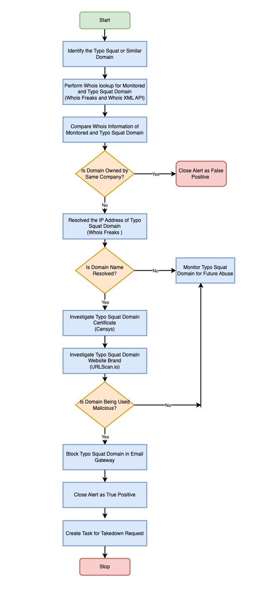

| [Home](../README.md) |
|----------------------|

# Usage
Typo Squatting uses typographical errors such as missing or extra letters, adjacent key swaps, and similar typographic chicanery to attempt to hijack a portion of manually entered attempts to reach a target domain (facebook.biz). This is commonly used by attackers to install malware or credential harvesting attempts.

## Response Playbook &mdash; Investigate High Risk Typo Squatting Domain Response

This comprehensive solution helps with effortless investigation, orchestration, and alert generation for brand impersonation scenarios like Typo Squatted domains discovered by FortiRecon Brand Protection.

With our solution, you can proactively detect and address impersonation attempts. Seamlessly integrated with FortiRecon, our solution create real-time alerts when typo squatted domains related to your brand are found and investigate that alert.

- The response playbook **Investigate High Risk Typo Squatting Domain** Response becomes available for execution after selecting the alert record of type Typo Squat. The playbook's flow is as follows:

1.	Identify the potentially squatting domain (Typo Squat domain) and the monitored domain (Brand domain)
2.	Perform a Whois lookup on both the monitored and potentially squatting domain using WhoisFreaks and WhoisXMLAPI integrations.
3.	Compare the Whois information of both the monitored domain and potentially squatting domain and close the alert as False Positive, if both the domains are owned by the same organization. 
4.	In case, the potentially squatting domain is not owned by the organization, resolve the IP address of the potentially squatting domain using WhoisFreaks integration. 
5.	Using the resolved IP address investigate the potentially squatting domain's SSL certificate (using Censys), the website's branding (using URLScan.io), and check if the potentially squatting domain is malicious.
6.	If the potentially squatting domain is found to be malicious, creates a task to take down the squatting domain, and blocks them on the email gateway.

    ||
    |:---------------------------------------------------:|

## Scenario &mdash; Typo Squatting Domain Detected

This scenario generates following three example alerts of Type *Phishing* in the FortiSOAR's **Alerts** module:

Refer to [Simulate Scenario documentation](https://github.com/fortinet-fortisoar/solution-pack-soc-simulator/blob/develop/docs/usage.md) to understand how to simulate and reset scenarios.

To understand the process FortiSOAR follows to respond to alerts related to typo squatted domains, we have included a scenario &mdash; **Typo Squatting Domain Detected** &mdash; with this solution pack.

1. **Typo Domain Detected - `microsoft-2022.online`**

    - The demo alert created is an example of a domain that is *Highly Suspicious*
    - The alert is of type *Phishing*
    - The reported alert contains the following information:
        - **Typo Domain**: `microsoft-2022.online`
        - **Original Domain**: `microsoft.com`
        - **Severity Score**: `67`
        - **Status**: `High`
        - **Source**: FortiRecon Brand Protection
        - **Source ID**: `d8c84a15-cd44-48ee-abbb-00904d31b066`
        - **Source IP**: `52.50.167.226`
        - Indicators created and associated for:
            - Monitored domain
            - Typo domain
            - Source IP Address

2. **Typo Domain Detected - `acmedemoshop.com`**

    - The demo alert created is an example of a domain that is *Critical*
    - The alert is of type *Phishing*
    - The reported alert contains the following information:
        - **Typo Domain**: `acmedemoshop.com`
        - **Original Domain**: `acmedemo.com`
        - **Severity Score**: `88`
        - **Status**: `Critical`
        - **Source**: FortiRecon Brand Protection
        - **Source ID**: `c8c84a15-cd44-48ee-abbb-00904d21b088`
        - **Source IP**: `99.83.154.118`
        - Indicators created and associated for:
            - Monitored domain
            - Typo domain
            - Source IP Address
            - Host

3. **Typo Domain Detected - `log-in-outlook.com`**

    - The demo alert created is an example of a domain that is *Critical*
    - The alert is of type *Phishing*
    - The reported alert contains the following information:
        - **Typo Domain**: `log-in-outlook.com`
        - **Original Domain**: `outlook.com`
        - **Severity Score**: `87`
        - **Status**: `Critical`
        - **Source**: FortiRecon Brand Protection
        - **Source ID**: `c7b74a25-cd12-34ff-cdes-17639d21b453`
        - **Source IP**: `199.34.228.168`
        - Indicators created and associated for:
            - Monitored domain
            - Typo domain
            - Source IP Address

| [Installation](./setup.md#installation) | [Configuration](./setup.md#configuration) | [Contents](./contents.md) |
|-----------------------------------------|-------------------------------------------|---------------------------|